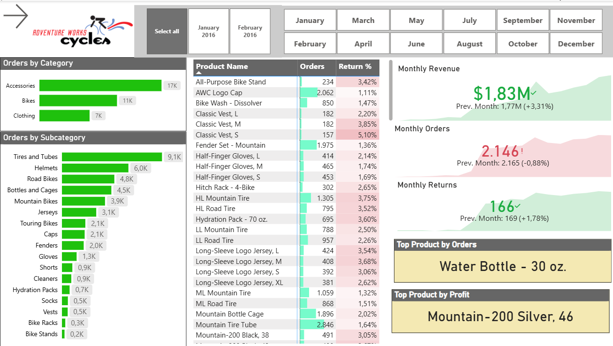
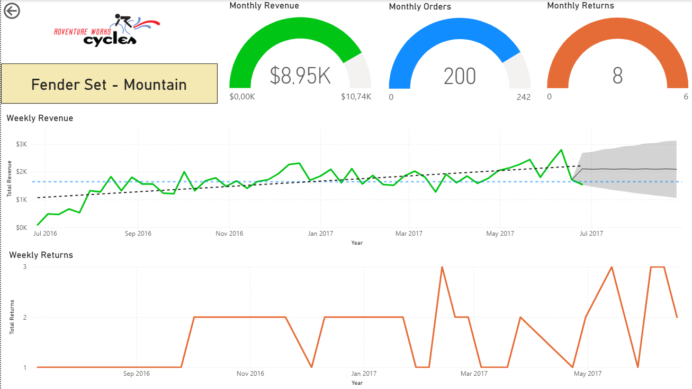
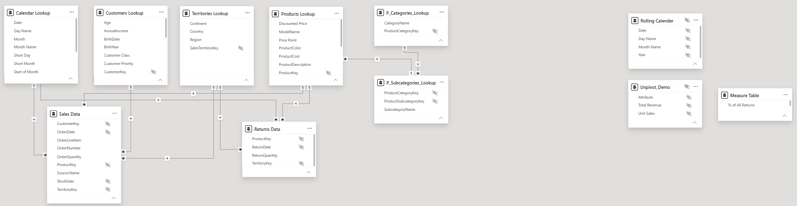

# Adventure Works Sales Analytics Dashboard

## Overview

This project is an interactive **Power BI sales analytics dashboard** built using the Adventure Works dataset. It analyzes sales performance, profitability, product performance, customer activity, geographic trends, and returns across **January 2015 to June 2017**.

The project demonstrates practical skills in **Power BI, DAX, Power Query, data modeling, KPI reporting, and data visualization**.

## Dashboard Preview

### Executive Summary



### Geographic Analysis


### Product Details



---

## Business Questions

The dashboard was designed to help answer questions such as:

* How are revenue, profit, orders, and returns performing over time?
* Which product categories and individual products generate the most revenue?
* Which geographic markets contribute the most sales?
* How is product performance changing month over month?
* Which areas of the business have the highest return activity?
* What trends can decision-makers identify from historical sales performance?

---

## Key Metrics

| Metric                   |              Result |
| ------------------------ | ------------------: |
| Sales Records            |              56,046 |
| Unique Orders            |              25,164 |
| Purchasing Customers     |              17,416 |
| Units Sold               |              84,174 |
| Total Revenue            |             $24.91M |
| Gross Profit             |             $10.46M |
| Returned Units           |               1,828 |
| Approx. Unit Return Rate |               2.17% |
| Analysis Period          | Jan 2015 – Jun 2017 |

---

## Dashboard Pages

### 1. Executive Summary

Provides a high-level view of business performance with important KPIs and sales trends.

The page focuses on:

* Total revenue
* Total profit
* Total orders
* Total returns
* Monthly revenue trends
* Orders by product category and subcategory
* Top-performing products
* Overall business performance

### 2. Map Analysis

Provides a geographic view of sales activity across Adventure Works territories.

It helps compare performance across countries and regions including:

* United States
* Australia
* United Kingdom
* Germany
* France
* Canada

### 3. Product Details

Provides a deeper analysis of individual product performance.

The page includes:

* Revenue trends
* Return trends
* Product-level KPIs
* Monthly performance comparison
* KPI gauges
* Weekly trend analysis

---

## Dataset

The data model is built from multiple related CSV files rather than a single flat dataset.

| File                        | Description                                   |
| --------------------------- | --------------------------------------------- |
| `Calendar.csv`              | Date dimension used for time-based analysis   |
| `Customers.csv`             | Customer demographics and profile information |
| `Products.csv`              | Product details, prices, and costs            |
| `Product_Categories.csv`    | High-level product categories                 |
| `Product_Subcategories.csv` | Product subcategory information               |
| `Territories.csv`           | Sales regions, countries, and continents      |
| `Returns.csv`               | Product return transactions                   |
| `Sales_2015.csv`            | 2015 sales transactions                       |
| `Sales_2016.csv`            | 2016 sales transactions                       |
| `Sales_2017.csv`            | 2017 sales transactions                       |

---

## Data Model

The project uses a relational data model connecting sales transactions with supporting dimension tables.

Core relationships include:

* Sales → Customers
* Sales → Products
* Sales → Territories
* Sales → Calendar
* Products → Product Subcategories
* Product Subcategories → Product Categories
* Returns → Products
* Returns → Territories
* Returns → Calendar

This structure enables filtering and analysis across customers, products, dates, geography, sales, and returns.



---

## DAX & KPI Development

The Power BI report uses calculated measures to support interactive KPI reporting.

Examples of measures used in the report include:

```DAX
Total Revenue
Total Profit
Total Orders
Total Returns
Return Rate
```

These measures support comparisons, trends, KPI cards, gauges, and interactive dashboard visuals.

---

## Key Findings

A few insights from the underlying sales data include:

* The business generated approximately **$24.91M in revenue** and **$10.46M in gross profit** during the analysis period.
* **Bikes** were the dominant revenue category, generating approximately **$23.64M**.
* **Accessories** generated substantially more order activity and unit volume than their revenue contribution suggests.
* The **United States** was the highest-revenue market at approximately **$7.94M**, followed by **Australia** at approximately **$7.42M**.
* The strongest revenue month in the dataset was **June 2017**, with approximately **$1.83M in revenue**.
* The highest-revenue individual products were variants of the **Mountain-200** bicycle.
* Approximately **2.17% of units sold were returned** based on total returned units relative to units sold.

---

## Tools & Skills Demonstrated

* **Power BI**
* **DAX**
* **Power Query**
* **Data Cleaning**
* **Data Transformation**
* **Data Modeling**
* **KPI Development**
* **Business Intelligence**
* **Data Visualization**
* **Sales Analysis**
* **Trend Analysis**
* **Geographic Analysis**

---

## Repository Structure

```text
adventure-works-power-bi-dashboard/
│
├── README.md
├── AW-Sales-Dashboard.pbix
│
├── data/
│   ├── Calendar.csv
│   ├── Customers.csv
│   ├── Product_Categories.csv
│   ├── Product_Subcategories.csv
│   ├── Products.csv
│   ├── Returns.csv
│   ├── Territories.csv
│   ├── Sales_2015.csv
│   ├── Sales_2016.csv
│   └── Sales_2017.csv
│
├── screenshots/
│   ├── executive-summary.png
│   ├── map-analysis.png
│   └── product-details.png
│
└── docs/
    └── data-model.png
```

---

## How to Use This Project

1. Clone or download this repository.
2. Open `AW-Sales-Dashboard.pbix` using **Microsoft Power BI Desktop**.
3. If required, update the CSV file paths in Power Query to point to the local `data/` folder.
4. Refresh the dataset.
5. Explore the dashboard using filters, slicers, maps, and drill-down interactions.

---

## Project Objective

The goal of this project was not only to create visualizations, but to build an analytical Power BI solution that transforms raw transactional data into meaningful business insights.

The dashboard demonstrates an end-to-end BI workflow:

**Raw Data → Data Transformation → Data Model → DAX Measures → Interactive Dashboard → Business Insights**
